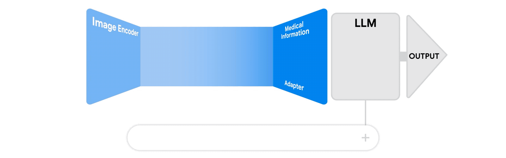

# NeuraVisionLLM: Multimodal Vision LLM built from Scratch

# 

> **`Note 1`**: Use  (recommended) in order to view the jupyter notebooks (nbviewer loads the notebook really fast compared to GitHub). You can see all the codes and the outputs in nbviwer without running the whole code again.

> **`Note 2`**: If you want to edit the notebooks and rerun cells, open notebooks in .

> **`Note 3`**: It has been observed that sometimes both  and  fail to properly render Table of Contents, animations and complex equations for some of the notebooks. In that case, render notebook in  itself.

## Status of Development:

1. The Evolution of Large Language Models: RNNs to Transformers and Beyond    
2. Intro to Large Language Models    
3. Design of Large Language Models    
4. Training of Large Language Models    
5. Inference of Large Language Models    
6. Popular LLM Families    
7. Popular Large Language Models Demo    
8. Multimodal AI: Uniting Vision and Language    
9. Design of Multimodal Vision LLMs    
10. Training of Multimodal Vision LLMs    
11. Inference of Multimodal Vision LLMs    
12. Popular Multimodal LLM Families    
13. Popular Visual Language Models Demo    
14. Design of NeuraVisionLLM Model    
15. Training of NeuraVisionLLM Model    
16. Deployment of NeuraVisionLLM Model    
17. [NeuraVisionLLM App Hosted at Hugging Face Spaces](https://huggingface.co/spaces/ancilcleetus/NeuraVisionLLM) 

## Results:

## Future Improvements Envisioned:

1. Deployment in my personal website [NeuraVisionLLM](http://ancilcleetus.com/Personal-Projects/Multimodal-AI-Projects/Multimodal_AI_Project_01_NeuraVisionLLM)

